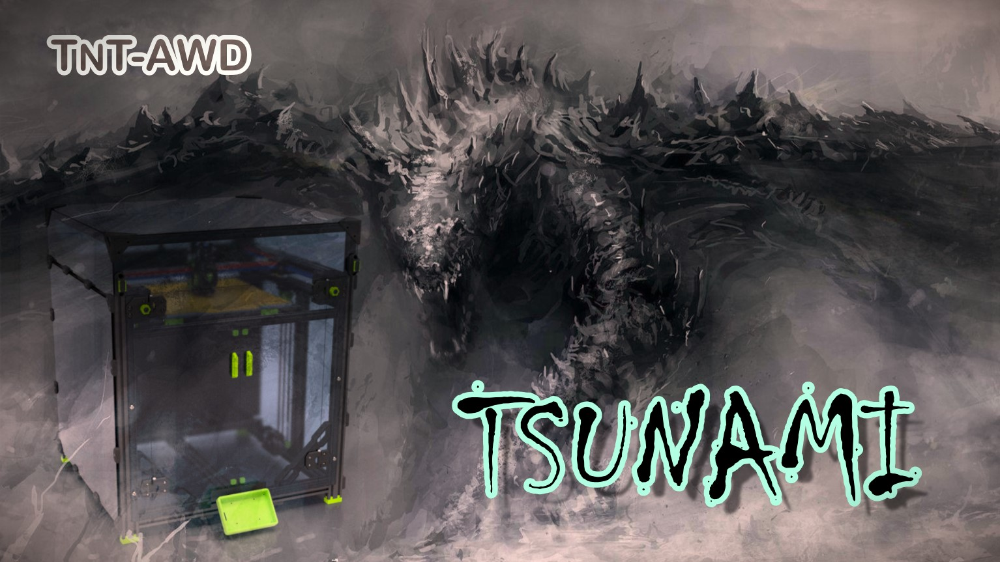
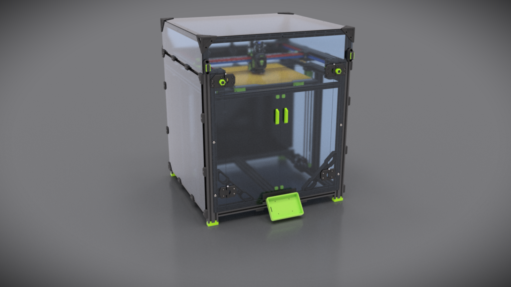

# TSUNAMI 3D Printer (TNT-AWD)
Evolution of TNT project with z-belt system and awd gantry

 
 
 

This project is inspired by Voron and VzBot. 
Thanks guys  

[You can view 3D realtime here](https://a360.co/456dvTG)  
 

 
The printer is provided without toolhead, if you want, you can use the SKT :)  
[You can find SKT here](https://github.com/insane78/Voron-SKT)
 
